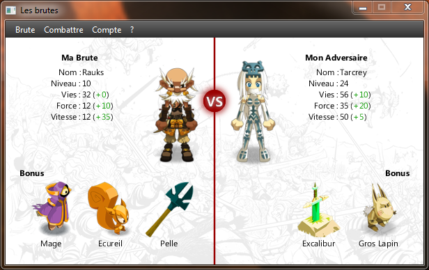

TP-Brutes
=========

TP "Brutes" - Réseau (Groupe 8)

Authors:
* Woditsch Karl (Client Java/JavaFX)
* Olivarès Georges (Serveur Java)

Le TP consistait à la création d'un client-serveur permettant la gestion et l'utilisation de Brutes : un système de combat interactif faisant évoluer son personnage (brute) avec expérience et bonus

Lancer le programme
===================

Simplement exécuter le jar.
Il script comporte un client et un serveur (création automatique d'une base de donnée) permettant de se connecter en **localhost**

Le protocole
============

Pour plus d'informations, consultez le [document relatif au protocol (.docx)](https://github.com/Rauks/TP-Brutes/blob/master/Structure%20du%20protocole%20-%20Groupe%208.docx)
